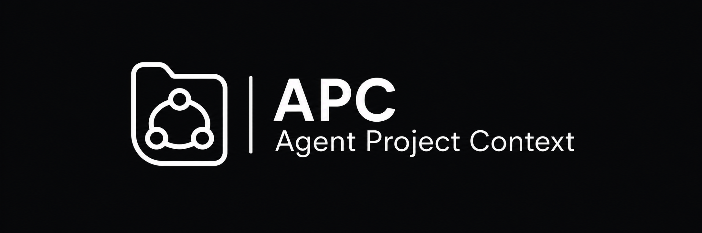

<p align="center">
  
</p>

> A portable, open convention for storing project-level AI agent context inside a repository.

---

## Why APC?

Every AI coding tool invents its own folder:

| Tool | Folder |
|------|--------|
| Claude Code | `.claude/` |
| Cursor | `.cursor/` |
| Windsurf | `.windsurf/` |
| Codex | `.codex/` |
| OpenCode | `.opencode/` |

A project that uses two tools now has two folders, two agent definitions, two memory files — all drifting out of sync.

**APC introduces one neutral, project-owned layer** that any tool or runtime can read.

---

## What APC defines

APC is a filesystem convention. It specifies:

- **Project metadata** — name, version, protocol version
- **Agent definitions** — role, model, skills, language, description
- **Durable memory** — per-agent `memory.md` that survives across sessions
- **Session records** — lightweight audit trail of what each agent did
- **Skill registry** — reusable prompt fragments agents can import
- **Tool hints** — optional MCP server declarations

APC does **not** define how runtimes execute, how models are called, or how UIs look. It defines only what a project owns on disk.

---

## Canonical layout

```text
project-root/
├── AGENTS.md                  ← human + machine readable agent registry
└── .apc/
    ├── project.json           ← project metadata
    ├── agents/
    │   └── <slug>/
    │       ├── <slug>.md      ← agent definition (frontmatter: role, model, skills…)
    │       ├── memory.md      ← durable memory, updated by the agent
    │       └── sessions/      ← one .md per invocation
    ├── messages/              ← JSONL activity log (one file per day)
    ├── mcps.json              ← MCP server declarations
    ├── skills/                ← reusable skill prompt files
    └── commands/              ← custom slash commands
```

---

## AGENTS.md

The `AGENTS.md` file at the project root is the entry point for any tool that follows this convention. It lists all agents and their properties in a format both humans and machines can parse:

```markdown
## sofia
- **Role**: Support
- **Model**: claude-haiku-4-5
- **Language**: es-AR
- **Skills**: customer-support, escalation
- **Description**: Sofia handles tier-1 support in Spanish.
```

This file is auto-generated from `.apc/agents/`. Edit the individual agent files; the AGENTS.md is the rendered view.

---

## APC and MCP

APC and MCP operate at different layers:

- **MCP** connects AI systems to external tools, data sources, and APIs
- **APC** describes how a *project* stores its own internal context on disk

They are complementary. A project can use both: APC for project context, MCP server declarations in `.apc/mcps.json` for tool access.

---

## Specification

The full protocol specification is in [`docs/APC-SPEC.md`](docs/APC-SPEC.md).

- [`docs/APC-OVERVIEW.md`](docs/APC-OVERVIEW.md) — motivation and design principles
- [`docs/APC-SPEC.md`](docs/APC-SPEC.md) — canonical on-disk format
- [`docs/APX-DAEMON.md`](docs/APX-DAEMON.md) — reference daemon API (APX)
- [`docs/APX-CLI.md`](docs/APX-CLI.md) — reference CLI (APX)
- [`docs/APX-SKILL.md`](docs/APX-SKILL.md) — skill injection format

---

## Reference implementation

**[APX](https://github.com/agentprojectcontext/apx)** is the reference implementation of APC:
a daemon + CLI that manages projects, runs agents across multiple runtimes (Claude Code, Codex, OpenCode, Aider), and keeps the filesystem as the single source of truth.

---

## Example project

See [`examples/my-first-project/`](examples/my-first-project/) for a working APC project layout with two agents, skills, and MCP declarations.

---

## Status

APC is in active development. The on-disk format is stabilizing at `v0.1`. Breaking changes will be noted in the spec.

---

## License

MIT
